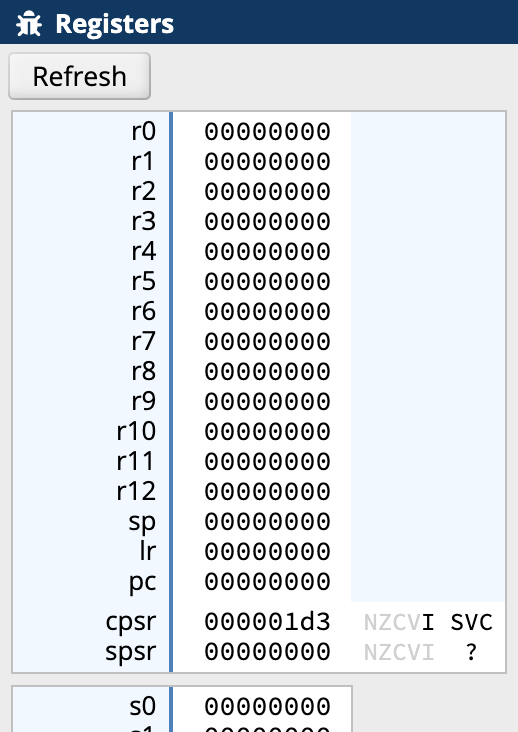
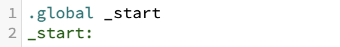
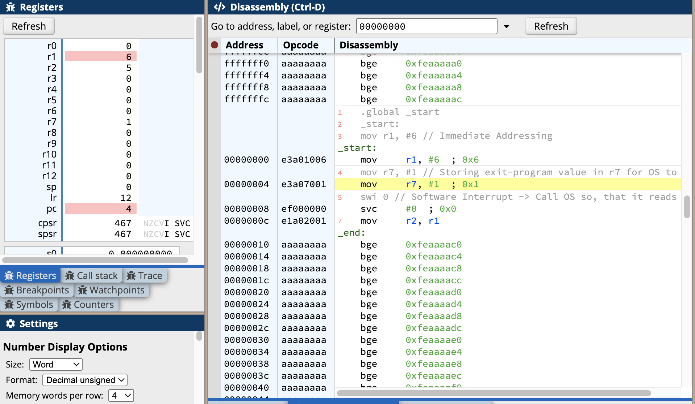
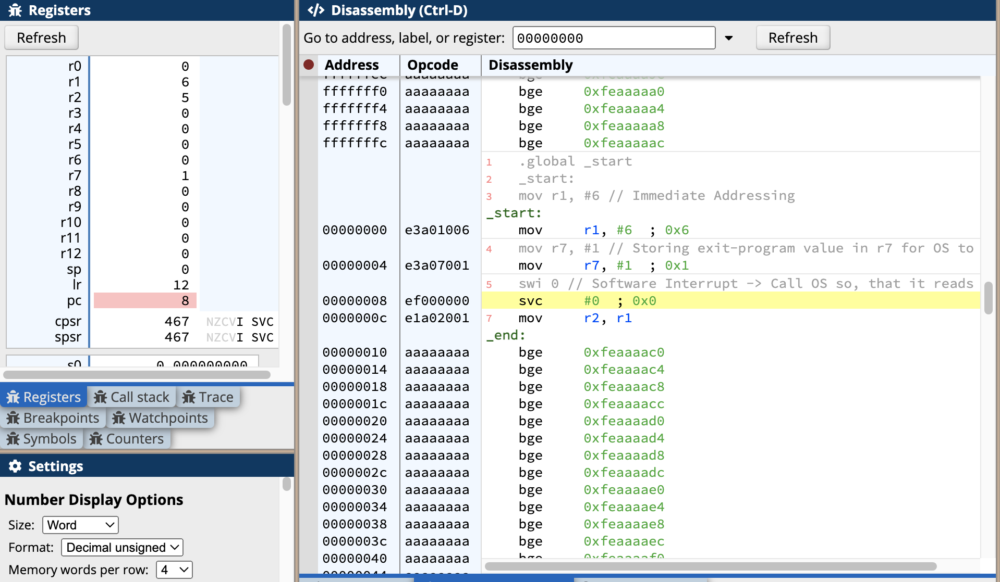
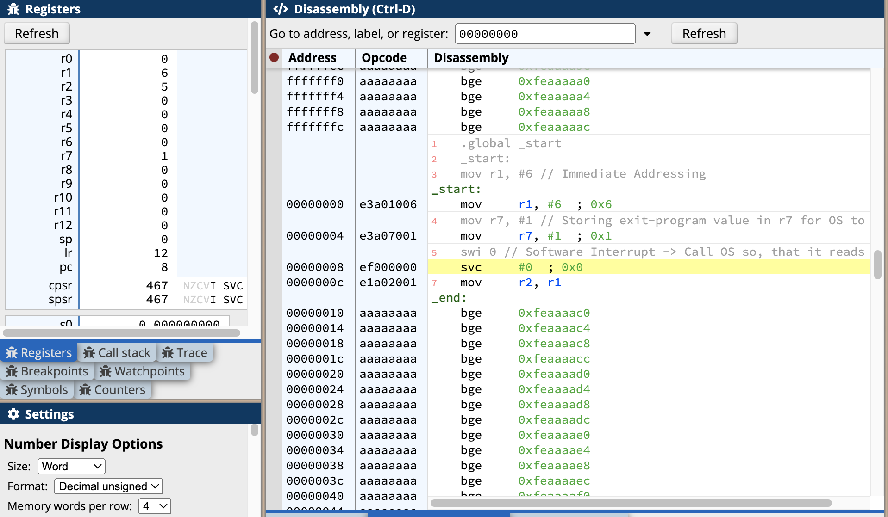

### Intro

- Using `ARMv7 DE1-SoC containing a ARMv7 processor.` on (https://cpulator.01xz.net/?sys=arm-de1soc)

### Registers

- `r0` till `r6` are general purpose registers as shown here:- . These are used to store usual data.
- The there is `r7`. This is used by the `OS`.
    - Sc: Say, we want to make `system calls` or `exit as program (e.g)`
    - This request by the user is done to the `OS`, using register `r7` say.
    - E.g: Store `#1` in register 7; the `OS` checks this value from `r7`, then maps it using a `table` to know to `exit the program.` After which OS, quits the program.

- `sp`
    - This is `stack pointer`.
    - This is used in `stack area`
    - Sc: Say, we hyave a array of contiguous items.
        - Using this pointer, if we have the `base address`, we can iterate over them.

- `lr`
    - Sc: Recall, when function calls are made are `return` or `last stmt` of a function is executed, the address of the nexdt `instruction` is stored in `lr`

- `pc`: Program Counter
    - Sc: Stores the address of the next instruction

- `cpsr`
    - Sc: When we want to know, if 
        - `ADD` has resulted in Overflow or `SUB` has resulted in a negative number (`This register's certain bit gets set.`)
        -  `ADDS` / `SUBS`


### Program Basics

- How to know start of a program?

    - `.global` and `_start`
    > [!NOTE]
    > - `_start:` is like a `function_name` 
    > - Everything under this and start of next label is executed in sequence.
    > - Synatx of `label`: `_<function_name>:`


### Most Important Basic Program

```arm
.global _start
_start:
	mov r1, #6 // Immediate Addressing
	mov r7, #1 // Storing exit-program value in r7 for OS to read
	swi 0 // Software Interrupt -> Call OS so, that it reads and exits
	mov r2, r1
```

- Starts from label `_start:`, Why? .global syas so.
- Let's see the memory and register for each of the following instruction and `register and memory states` after we `compile and hit step-into`
    - `	mov r1, #6 // Immediate Addressing`
        - Move number 6 immediately to r1
        - Any constant is prefixed by `#`. In case of hex, `#0xFFFF` -> 32 bit processor -> 1 word 32 bits -> At a time, 32 bits are processed.
        - Let's Compile and see the states, when `step-into`:-
        - AFter we hit `compile and load`, we get the `DisAssembly` view.
        - 
        - NOTE: The yellow and red lines.
        - `yellow` is where, next `instruction with address 000000004` is being shown and `red` is `pc` with value `4` i.e `referring to instruction addr that is going to be executed next` 
        - Also, note, since prev instruction is successfully executed, r1 has value `6`    
        - Ignore others.   

 
 #### Hitting `Step-into States`



- Just executed: `mov r7, #1`, stores value `7` in `R1`. Verify
- Next to be executed: `swi 0`

 - `pc` has value `8` and next instruction at address 8 is `swi 0 // Software Interrupt -> Call OS so, that it reads and exits
	`mov r2, r1`

- Since, the next instruction is `sys-call`, no more `red-line`
    - 
    - After this, the OS reads 1 from r7 then maps from table and exits the progrma.
    - Even if we hit `Step-into`, no effect. 
    > [!NOTE]
    > - The instruction `mov r2, r1`, is never reached. It's like something written after `return` stmt.
