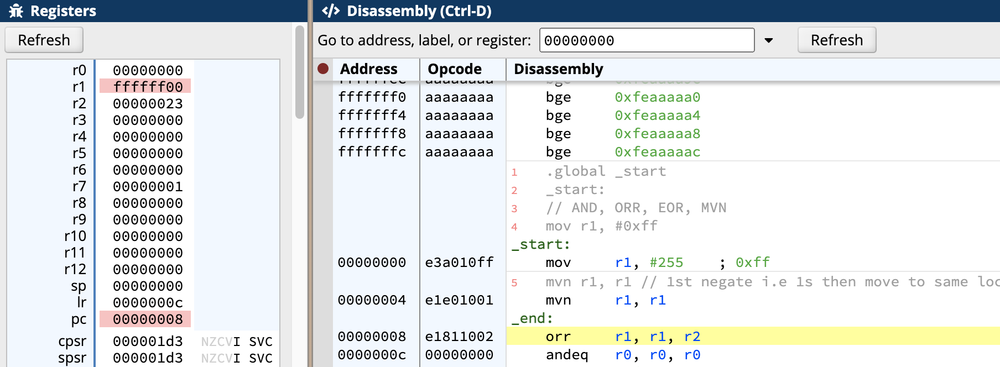

#### Logical AND (`reflecting set bits`)

- Syntax: `and dst src1 src 2`
- Opcodes: `and, orr, eor, mvn`

```arm
.global _start
_start:
	// AND, ORR, EOR, MVN
	mov r1, #0xff
	mov r2, #0x23
	// and dest, s1, s2 
	and r1, r1, r2
```

- For above code, 
    - r1: 0xff means: => (1111 1111) => 255
    - r2: 0x23 means: => (0010 0011) => 2**5 + 3 = (35) in decimal
    - r1(dest):       => (0010 0011) => 35 [reflects set bits]
    - OR: Anyway all 1's in r1 -> 0xff [Ans]
    - EOR: (1101 1100) ->  13*(2**4) + 12 = 220


- As we can see, r1, r2 have as calc.

#### ORR, EOR on above
```arm
.global _start
_start:
	// AND, ORR, EOR, MVN
	mov r1, #0xff
	mov r2, #0x23
	// and dest, s1, s2 
	orr r1, r1, r2 // or
```
As expected below.


```arm
.global _start
_start:
	// AND, ORR, EOR, MVN
	mov r1, #0xff
	mov r2, #0x23
	// and dest, s1, s2 
	eor r1, r1, r2 // exor
```
As Expected below.


#### MVN
- All it does is `negates` i.e 1's on src-data, then moves to dst data
```arm
.global _start
_start:
	// AND, ORR, EOR, MVN
	mov r1, #0xff
	mvn r1, r1 // 1st negate i.e 1s then move to same location
```
