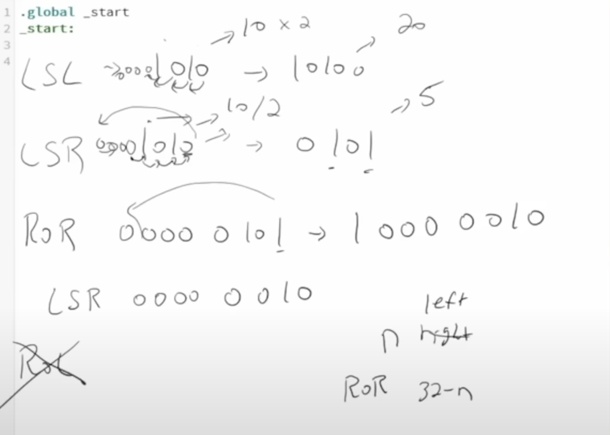

#### Viz



#### lsr and lsl
- lsl <register_name>, #<num_of_times_apply>

```arm
.global _start
_start:
	// LS{L/R} -> Logical Shift Left/Right
		// If R, goes from RMost bit and appends 0 at left
		// recall e.g: 0xf -> LSR r1, #<num_of_times_to_apply> -> Does it in one instruction
	mov r1, #10
	lsr r1, #1 // 10/2 = 5
	
	// LSR, LSR -> Right -> /2 and Left *2 => Why? I know why.
	lsl r1, #1 // 5*2 back to 10
```

- Can club, ls operations <Special Form>
    - Sc 1: 2 instructions
    ```arm
    .global _start
    _start:
    // Sc: 1 -> Finally, r1 = 1, r2 = 2
        mov r1, #1
        mov r2, r1
        lsl r2, #1
    ```

    - Sc 2: 1 instruction
    ```arm
    .global _start
    _start:
        mov r1, #5
        // Sc 2: -> Can do in 1 instruction	
        mov r2, r1, lsl #1
    ```

#### ror, [lor can be achieved using ror, so not present]

`lor is 32-n times perform ror`
