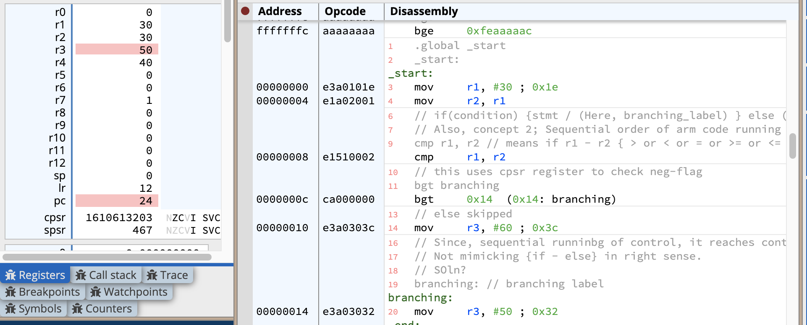
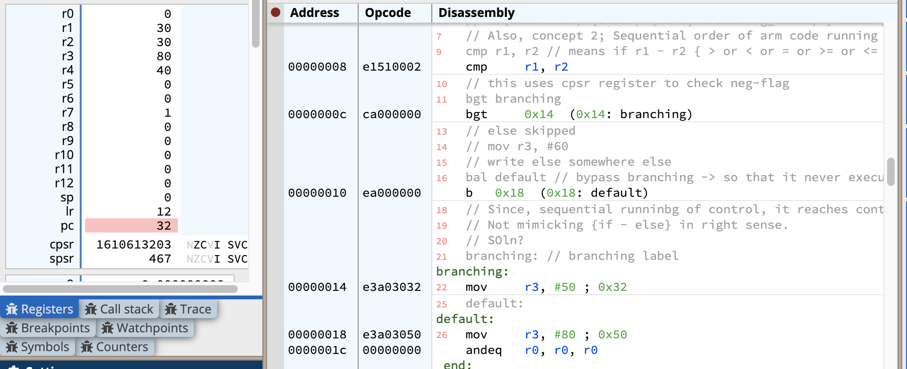

### Conditionals and `cmp under the hood, + cpsr register funda`

```arm
.global _start
_start:
	mov r1, #30
	mov r2, r1
	
	// if(condition) {stmt / (Here, branching_label) } else (skip this stmt and goto next)
	// Also, concept 2; Sequential order of arm code running
	
	cmp r1, r2 // means if r1 - r2 { > or < or = or >= or <= } 0
	// this uses cpsr register to check neg-flag
	bgt branching
	
	// else skipped
	mov r3, #60
	
// Since, sequential runninbg of control, it reaches control to brancging
// Not mimicking {if - else} in right sense.
// SOln?
branching: // branching label
	mov r3, #50
```

- For, the above code, it ideally wants to mimic if-else i.e if{ bgt(r1, r2) } then execute `branching label stmts`, else skip [`bgt branching`] and execute next.

- This is done, looking at the `cpsr` flag has zero, neg set?


- Issue: Even if `r1 > r2` is false, still the final state of r3 has `50`, stored after getting overwritten.
> [!NOTE] There's a flaw, as arm executes, sequentially, it anyway executes, branching, w/o caring about if-condition check {eventually}, so we need a solution to this.

### Solution: Bypass this

```arm
.global _start
_start:
	mov r1, #30
	mov r2, r1
	
	// if(condition) {stmt / (Here, branching_label) } else (skip this stmt and goto next)
	// Also, concept 2; Sequential order of arm code running
	
	cmp r1, r2 // means if r1 - r2 { > or < or = or >= or <= } 0
	// this uses cpsr register to check neg-flag
	bgt branching
	
	// else skipped
	// mov r3, #60
	// write else somewhere else
	bal default // bypass branching -> so that it never executes
	
// Since, sequential runninbg of control, it reaches control to brancging
// Not mimicking {if - else} in right sense.
// SOln?
branching: // branching label
	mov r3, #50
	
	
default:
	mov r3, #80
```


> [!NOTE]
- Now, we can see `r3` has value 80 as expected and it actually skips if-part, by bypassing that stmt using `bal i.e branch all`
- `bal` is always executed, no matter what by the compiler.


### Other conditions

- `bge`
- `blt`, `ble`, `beq`
- `bne`

Can you recall the names for these?